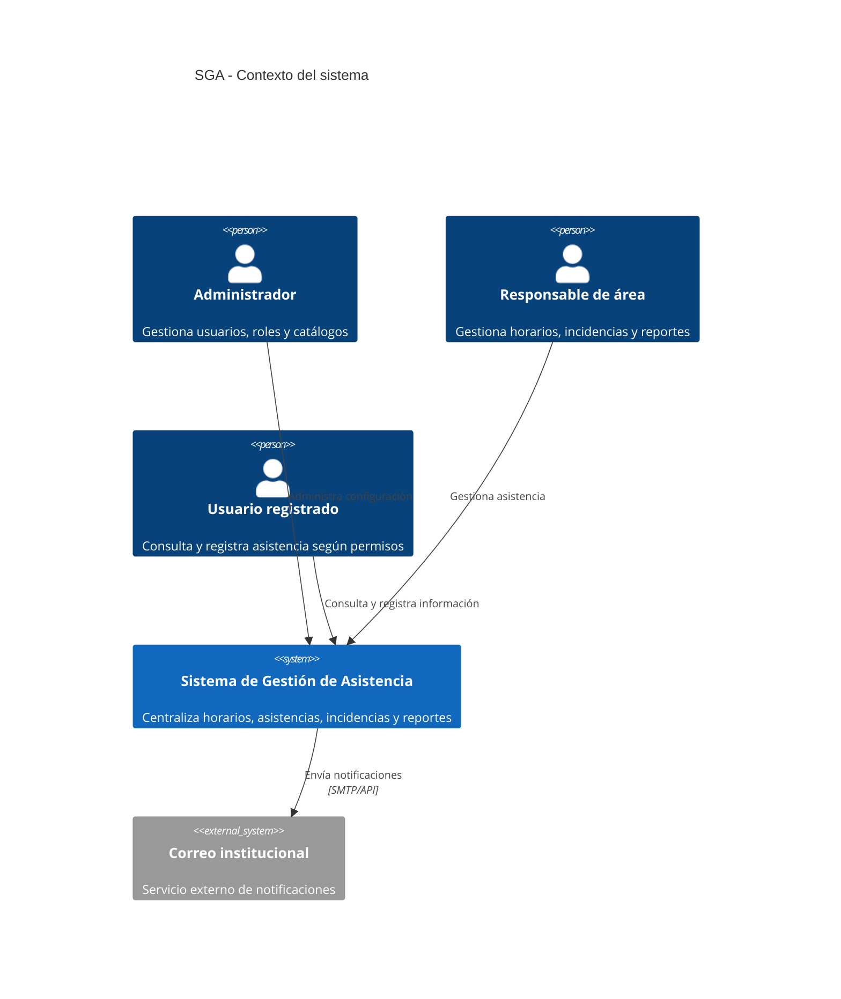
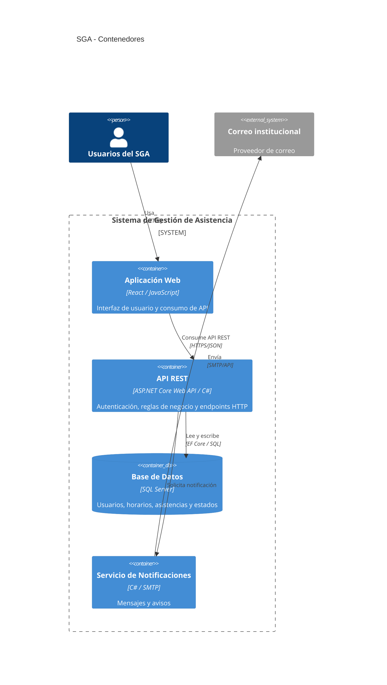
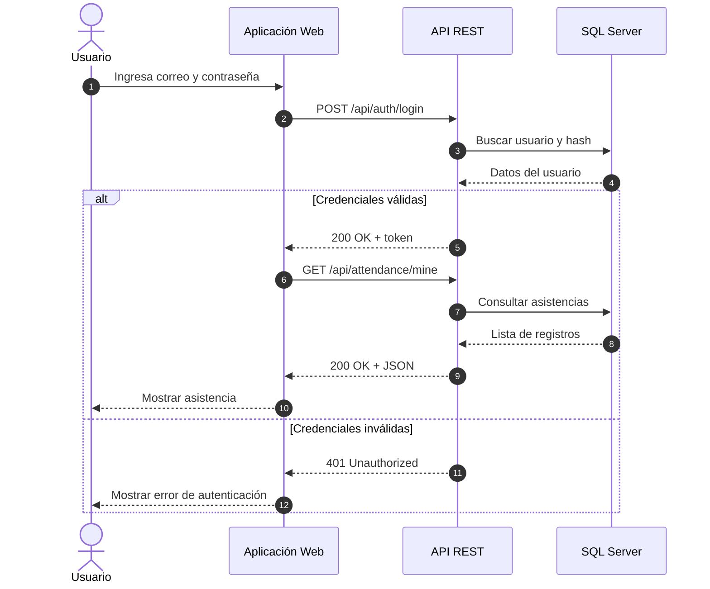
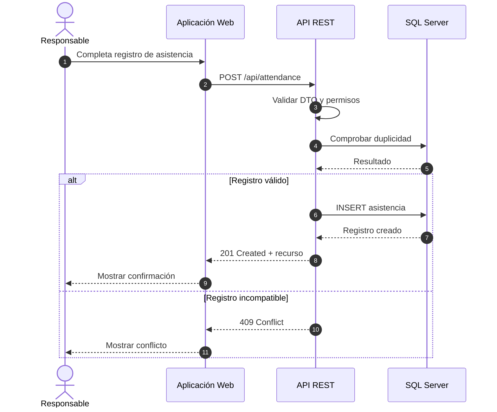

# Sistema de Gestión de Asistencia (SGA)

## Arquitectura

La arquitectura se documenta con el Modelo C4 y diagramas de secuencia bajo un enfoque API-First.

### C4 Nivel 1 - Contexto

### C4 Nivel 2 - Contenedores

### Secuencia 1 - Login y consulta de asistencia

### Secuencia 2 - Registro de asistencia

## API principal

| Método | Endpoint | Descripción |
|---|---|---|
| POST | `/api/auth/login` | Autenticar usuario |
| GET | `/api/attendance/mine` | Consultar asistencia del usuario |
| POST | `/api/attendance` | Crear registro de asistencia |
| PATCH | `/api/attendance/{id}/classification` | Clasificar o corregir incidencia |
| GET | `/api/reports/attendance` | Consultar reporte de asistencia |
